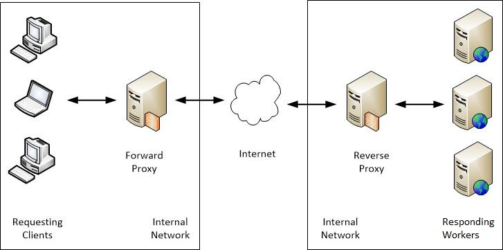

# Deploying Projects

*These notes will explain how to set-up a Flask application using Gunicorn as the application server and Nginx as a reverse proxy, running on the VPS Digital Ocean.*


**1. Setting up a Virtual Private Server:**   
A VPS is a siloed space on a server that has the characteristics of an entire server itself, with its own Operating System (OS), applications, resources, and configurations.  

**2. Setting up the webserver NGINX**  
NGINX is a web server which serves files to a web user or client. 
It accepts HTTP requests, takes care of general domain logic and handles https connections  

**3. Deploy a Flask app using the application server Gunicorn**   
Gunicorn is a Web Server Gateway Interface (WSGI) server implementation that is commonly used to run Python web applications. It translates HTTP requests into something Python can understand. The web application can be build with flask or Django, which are web development framework developed in Python.

 


## 1. Setting up a VPS


### What is a virtual private server? 
A server is a computer dedicated to storing information or an application and making that info/app available over a network. A server can refer to multiple concepts:

- *Hardware server*: the actual physical computer.  
- *Server software*: software (such us NGINX) that tells the network where to find the stored information and/or runs your app. 
- *Virtual private server*: software that essentially pretends to be a full hardware computer, upon which server software is also run.

A basic server:

Multiple VPS on a harware server:


[READ: A beginners guide to to VPS hosting](https://www.websiteplanet.com/blog/what-is-vps-hosting/)

### Setting up a VPS on Digital Ocean
 1. Create an account with Digital Ocean, a cloud hosting provider. 
 2. Create a VPS, called Droplets on Digital Ocean
 3. Select an image to be copied to your server. An image is a clone of a pre-installed version of distribution, such as Ubuntu (Linux). This copy will be the inistial state of your server.  Ubunutu is the most well known and user friendly distribution for a linux system. linux is generally preferred over a window operating system, because most versions are free of charge. 


 4. Add an SSH key  
   
    *SSH keys are a pair of public and private keys that are used to authenticate and establish an encrypted communication channel between a client and a remote machine over the internet.*

    Your SSH jey is stored in the ~/.ssh/ folder. They can be viewed by 
    ```
    $ ls -al ~/.ssh
    ```  
    This will also show a known_hosts file. This file keeps track of all servers (hosts) which you have connected with before and you trust as a safe host. 

    The keys can be viewed by the commands:
    ```
    cat ~/.ssh/id_rsa
    ````

     ```
    cat ~/.ssh/id_rsa.pub
    ````

    [Read about SSH keys](https://dev.to/risafj/ssh-key-authentication-for-absolute-beginners-in-plain-english-2m3f)  
    [Read on generating a SSH key on Windows](https://www.howtogeek.com/762863/how-to-generate-ssh-keys-in-windows-10-and-windows-11/)

 5. Choose a datacenter near you, to prevent latency while working on the server. In practice you will pick this based on where your customers are located.
 6. Choose a name for your project and click create droplet to set up your VPS.

 7. You can log in to the server via the terminal. Use the IP address shown in Digital ocean and the command:  
    ```
    ssh root@<ip-address>
    ```

    Accept the authenticy of the host if asked.If accepted, a fingerprint will be added to the know_host file in the ~/.ssh folder.   
    Commands you enter while logged in are not executed on your own computer but are instead sent to the remote device and executed there. This is only the case for this specific session, other windows are not logged in to the server. If you close the window, you'll have to log back in again in a new session.


   8. Update all Ubuntu packages installed on the VPS using the package       manager 'apt' (Advanced Package Tool), as the initial (Ubuntu) image copied to the server may be outdated.  Use the command ```$ apt update``` to update the package sources list with the latest versions of the packages in the repositories. Then use ```$ apt upgrade``` to compare the version of all the packages currently installed on the system with the ones in the list we fetched through ```$ apt update``` and upgrade all of them to their latest versions.

   9.   ```ssh root@<ip>``` 
   All users on a Linux system get a home directory, which can be found inside /home/. A user 'winc' for example would own the /home/winc/ directory and keep his files there. You can return here by running ```cd``` without any arguments.  
   The root user however has it has its own home directory, which you land in when you first logged in. It has the highest level of permissions to modify the system.   
   *You can refer to $HOME by using the ~ symbol. For example, you can create a new file in your home directory regardless of your current working directory by running touch ~/example.txt* 

## 2. Setting up the webserver NGINX

On top of the server hardware, possible VPS and the operating system running on it (Ubuntu), a webserver is needed to listen for connection requests. A web server is simply a program that uses HTTP to serve files to users as a response. One of the most widely used opensource webserver is Nginx.

Nginx is able to serve static files to a web user or client. Files are literal documents: HTML, CSS, PNG, PDF etc. Historically, before the advent of frameworks such as Flask and Django, it was common for a website to function essentially as a direct view into a file system. In the URL path, slashes represented directories on a limited part of the server’s file system that you could request to view. 

**On reverse proxy's**  
In addition to serving static files, Nginx can also operate as a reverse proxy. The reverse proxy will forward incoming HTTP requests to an application server (such as Gunicorn), fetch a response, and sends it back to the client. 


 

*Forward proxy*:  
An intermediary used by one client in order to connect to any number of servers.   
*Reverse proxy*   
An intermediary for all clients to connect to a server: a gatekeeper that all visitors to your website go through. It makes it easy to filter out malicious users, encrypt/decrypt traffic (SSL/TLS) and reroute requests to the right spot, all in one place.




**Uses for a reverse proxy include:**  


*1. Routing and load balancing with multiple application servers*  
When a site needs multiple servers because the volume of requests is too much for a single server to handle efficiently, a reverse proxy server can act as a load balancer. The reverse proxy distributes incoming traffic around several backend servers with identical versions of a website and ensuring no one server is overloaded. If a server goes down, the load balancer redirects traffic to the remaining online servers.  

[Read more on load balancing](https://www.nginx.com/resources/glossary/reverse-proxy-vs-load-balancer/)
 
Seperate from load balancing, onde domain running on several servers could serve  *different versions* of the website, say for different languages. The client doesn't know which server to make the request to. We can configure a proxy server in between the client and the server that can route the request to the appropriate server based on certain deterministic criteria (like client ip-address or language http headers sent by browser).

When you don't have multiple back-end / application servers, deploying a reverse proxy even with just one application server can have the following benefits: 

*2. Web acceleration*   
Reverse proxies can compress inbound and outbound data, as well as cache commonly requested content, both of which speed up the flow of traffic between clients and servers. They can also perform additional tasks such as SSL encryption. Only one public IP address and one SSL certificate would be needed which takes of the load from the application servers (SSL / TLS Termination).  

*3. Security and anonymity*   
A reverse proxy hides the identity and details of the backend application server(s) from the internet. In addition, you can filter traffic on Nginx, which can make it hard for attackers to target origin server(s) with DDoS attacks

*As a web server NGINX can very efficiently serve static files. This means that, for requests for static content such as images, you can cut out the middleman that is Flask/Django and have Nginx render the files directly*


**Hosting multiple websites on a single server**  
Nginx also comes in handy when hosting multiple websites or web applications on a single server or VPS. It is economical if you use a single server for all your domains, as you can use the same server resources for different websites. You can host an unlimited number of websites on one server. When using the Nginx web server, server blocks (similar to virtual hosts in Apache) can be used to encapsulate configuration details.
[READ MORE AT CLOUDPANEL ](https://www.cloudpanel.io/tutorial/how-to-host-multiple-websites-on-one-server/)  [OR KEYCDN](https://www.keycdn.com/support/nginx-virtual-host) on configuring Nginx to serve multiple websites on a single VPS  


**Setting up NGINX**  

In Ubuntu we can simply install and enable Nginx by running:

```
sudo apt install nginx
sudo systemctl enable nginx
sudo systemctl start nginx
```
Nginx will be installed and activated with the default configuration, including the HTML for the welcome page. If you visit the IP of your VPS in your browser, you should see this welcome page.  You can the HTML in the directory /var/www/html. 

For different operations on Nginx such as start, restart, reload, etc – refer to the below commands:

```
sudo systemctl status nginx
sudo systemctl start nginx
sudo systemctl stop nginx
sudo systemctl restart nginx
```
If you are simply making configuration changes, NGINX can often reload without dropping connections:
```
sudo systemctl reload nginx
```
To test your config file:
```
sudo nginx -t
```

**NGINX Files and Directories**

- ```/var/www/html```:  
The actual web content, which by default only consists of the default Nginx welcome page , is served out of this directory. This can be changed by altering NGINX configuration files.
- ```/etc/nginx```:  
The NGINX configuration directory. All of the Nginx configuration files reside here, with 'nginx.conf' the main configuration file. This can be modified to make changes to the NGINX global configuration. The default Nginx server block is */etc/nginx/sites-available/default* which serves the default HTML file at /var/www/html/index.nginx-debian.html. It looks as follows:

   ```
   server {
         # the port that Nginx receives requests from a Web client
         listen 80;
         listen [::]:80;

         server_name example.com;
         
         # Indicate the folder where this website's files live
         root /var/www/example.com;
         
         # Which file should be returned for a request to /
         index index.html;

         # Any other files should be looked for 
         # relative to the root directory
         # If they are not found, serve a 404
         location / {
               try_files $uri $uri/ =404;
         }
   }
   ```
- ```/etc/nginx/sites-available/```:   
Contains individual configuration files or so called per-site 'server-blocks' for all websites. Typically, all server block configuration is done in this directory, and then enabled by linking to the other directory. NGINX will not use the configuration files found in this directory unless they are linked to the sites-enabled directory. 
- ```/etc/nginx/sites-enabled/```:   
Contains *links* to the configuration files that NGINX will actually read and run, thus enabled per-site “server blocks” are stored here.Typically, these are created by linking to configuration files found in the sites-available directory.

   *These are called a symlinks, which stands for symbolic links. It will appear and behave like a normal file, but it is actually a reference to the original file in another folder. It will appear blue in Bash. Directories can be symlinked too. Use ```-lha``` to see the full link. 
   Symlink the Nginx server block to the ```/etc/nginx/sites-enabled/``` directory as shown:*
   ```
   $ sudo ln -s /etc/nginx/sites-available/<filename> /etc/nginx/sites-enabled/<filename>
   ```


- */var/log/nginx/access.log*:  
Every request to your web server is recorded in this log fil unless and until NGINX is configured to do otherwise.  
- */var/log/nginx/error.log*:  
Every NGINX error will be recorded in this log only.

 ## 3. Deploy a Flask app using the application server Gunicorn

Our application will now be accessible through the webserver Nginx on port 80. The python application (Flask/Django) and Gunicorn components themselves are not exposed to the public internet but rather sit behind the Nginx reverse proxy. Nginx will send incoming HTTP requests to Gunicorn. Gunicorn then prepares a response by using the Flask application and returns it to Nginx, which then sends it back to the client again.
 

   
**Creating a minimal flask app**     
 Flask is a web framework which you can use to build your core web application that powers the actual content on the website. It handles HTML rendering, authentication, administration, and backend logic.

An example of a minimal flask application is the following:

 ```
 from flask import Flask

app = Flask(__name__)

@app.route('/')
def index():
    return 'Hello, world!'

@app.route('/cow')
def cow():
    return 'MOoooOo!'

   ```

[Quickstart to Flask app](https://flask.palletsprojects.com/en/2.2.x/quickstart/) 

**Running a Flask app from your local machine**

Save the app under the name 'main.py' in a new directory (ig called 'farm'). You can run the app on your local machine using the flask command. You will first need to tell the Flask where your application is by setting the FLASK_APP environment variable.    

In Powershell:

```
> $env:FLASK_APP = "main"
> flask run
```

or in Bash

```
$ export FLASK_APP=main
$ flask run```
```

[Read more on setting the FLASK_APP env variable](https://flask.palletsprojects.com/en/2.1.x/cli/)  

The above commands launches a simple built-in server, which can be used to test the application. The development server will tell you at which url it can be reached, most likely http://127.0.0.1:5000 or localhost:5000.

*The localhost is the default name for the ip address of the local computer, which allows the machine to connect to en communicate with itself.  Localhost is also referred to as the loopback address - it loops you back to the machine you are logged into. ([READ MORE](https://phoenixnap.com/kb/127-0-0-1-localhost)).*

What happens when you visit that url in a browser is this:

1. Your browser sends a request to the Flask development server.
2. The Flask development server receives the request.
3. It executes the function from your Flask application that the type of request that it received.
4. Finally, it returns the return value of this function to the browser.

As this built-in development server is not suitable for real-world usage, commonly a dedciated application server such as Gunicorn is used when deploying your app from a server


**Running a Flask app from your VPS using Gunicorn**

Gunicorn is a WSGI server that is widely used to deploy Python applications. The Web Server Gateway Interface (WSGI) is a standard interface between web server software and web applications, and is necessary because traditional web servers do not understand how to run Python code. The primary use of WSGI is to convert requests into a python readable format and send it to the application code (written in Flask-python), which then performs the necessary functions and returns the response Webpage


You can install Gunicorn on the VPS using pip:

```
pip install gunicorn --upgrade
```

In our example, the Flask (WSGI) application on our local machine lives inside a file main.py with the variable name app. The containing folder is called farm. 

The folder containing the app can be copied to the remote server (VPS) using scp (secure copy) and -r for recursive (for copying a folder):

```
scp -r farm root@<SERVER_IP>:/var/www
```


Make sure that all packages that the app depends on are installed on the server with pip, including the Flask framework and it extensions. If you have a requirements file, you can simply install your project’s requirements using the following using:

```$ pip install -r requirements.txt```


To run the application on the VPS, run the following command from the same directory of main.py:

```
gunicorn main:app
```
To have Gunicorn listen for connections from the entire internet, not just your local machine, add one option:

```
gunicorn main:app -b 0.0.0.0
```

If you do all of the above on the VPS you have running at DigitalOcean's, you should be able to go to <SERVER_IP>:8000 in your browser and see your Flask app now!


