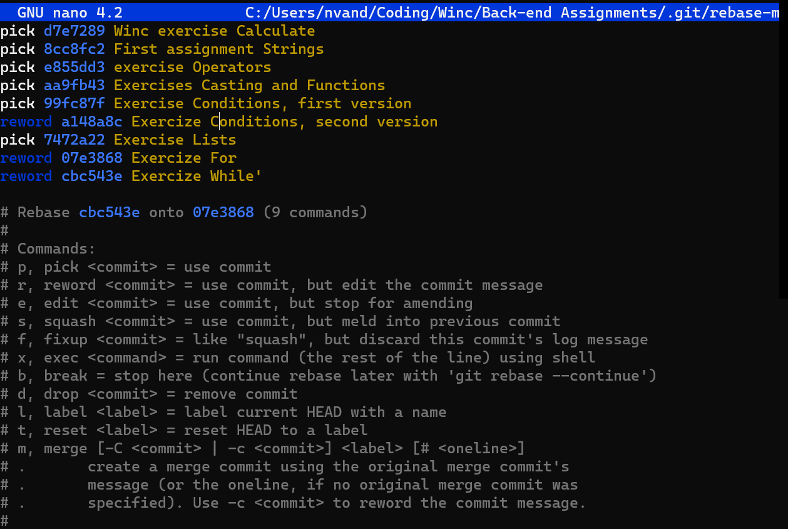
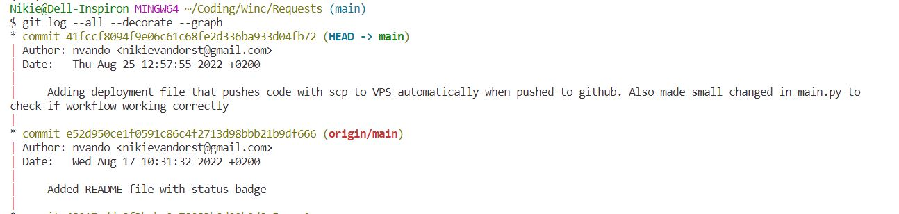

# Git and Github

## Committing files   

```
git add
```

Adds a change in the working directory to the staging area. It basically tells Git to include updates to a particular file in the next commit: it marks the updated files you would like to commit. Changes are not actually recorded until you run git commit.   
   
```
git add -i
```
Select specific files by number through the command index
   

- select range: ```1-22```
- select all: ```1-```    

if you wish to add all files, use ```add 'foldername'``` instead  

```
git commit
```

A commit is the Git equivalent of a "save".  
After git commit your local repository has a new version with all staged files
Git commit will open up the locally configured text editor and prompt for a commit message to be entered.  

```
git commit -m "commit message"
```
Passes a commit message immediately with the commit.  

```
git push
```
sends a commit to Github  

```
git commit --amend
```
Allows you to modify the last commit
- change it's name
- add updated files to the commit
- delete files from the commit

You can't push a changed commit, it will give an error message because of the changes. Therefor, use ```git push -f```   

```
git diff
``` 
This command displays the differences between files in two commits or between a commit and current repository.
Git diff only shows unstaged changes against HEAD (or any hash or branch you supplied), but leaves out files you already staged for the next commit.

To diff any added changes, use:

<!-- ```git diff --staged``` -->

## commiting files that changed name or folder

When commiting files after being renamed or moved to a different folder, git will recognize that  these files are the same as previous added files as long as the files itself did not change (much)
. Make sure to add the file that changed name/folder and remove the old filename/filepath with git rm, within the same commit. 


## .gitignore

A gitignore file specifies intentionally untracked files that Git should ignore.

1. open repository folder in VSCode
2. create new file
3. save as .gitignore
4. add files you wish to ignore
5. commit .gitignore file 

[More on .gitignore](https://www.atlassian.com/git/tutorials/saving-changes/gitignore)   

## Creating a new repo on the command line
  
``` 
echo "# my-new-repo" >> READ.md
```
Optional: creates new empy file from command line to commit  
 
```
git init
```
in folder where assignments or project files are located  
  
```
git add README.md
```
Optional: you can also create a repo and add/commit files to it later on.  
  
```
git commit -m "first commit"
```
 
```
git remote add origin https://github.com/your_username/your_new_repository_name.git
```
Links Github repository to your local repo.  
**remote**: Local computer repo  
**origin**: Github  
  
```
git push -u origin master
```
Sets upstream branch, only needs to be done once  
  


```
git stash
```
Git slaat tijdelijk alle gemaakte wijzigingen aan bestanden die git in de gaten houd op, en zet de status (inhoud van bestanden) terug naar hoe deze was tijdens de laatste commit  

Dit kan handing zijn als je gemaakte wijzigingen in bestanden die nog niet afzijn tijdelijk wil parkeren. Dit kan bijvoorbeeld nodig zijn voor het fixen van een bug (waarbij je dus nieuwe wijzigingen maakt die los staan van de wijzigingen waarmee je daarvoor bezig was)

Use ```git stash pop``` to undo the stashing after finishing.  

## Amending previous commits


When needing to add files to previous commit before being pushed, simply use below commands and git wil automatically add the file to the last commit

```
git add <filename>
git commit --amend
```


Amending multiple previous commits can be done using the ```rebase``` command

Use the ```rebase``` command to take series of commits which need to be edited and optionally transfer those to a different branch

```
git rebase -i --root 
```

Takes everyhting from last commit downwards, as a range to make amendments on (Don't use commit# to stay on master branch).


Use ```reword``` to edit the commit message specifically. 

. 

 
After quiting the command editor, git will take you to edit the commit messages one by one. 

These edits will change all commit hashes (or ID's) from the earliest commit you edit.

*The commit ID is afhankelijk van de commit message, ID van de parent, en de inhoud van de commit (bestand).Als een van deze drie dingen wijzigt, veranderd ook de hash zelf. Zodra je in het midden van de keten van commits een commit wijzigt, verandert niet alleen de hash van die particular commit, maar ook de ID's of hashes van alle commits die erna komen.*  

Last step: 
```
git push -f
```
Omdat nu alle commit hashes vanaf de gewijzigde commit zijn verandert, kun je niet simpel pushen naar github. Daarom gebruik je ```git push -force``` en kun je deze manier van commits wijzigen alleen gebruiken individuele projecten.  

Use ```git squash``` om commits samen samen te voegen in 1 commit. Dit kan bijvoorbeeld handig zijn als je meerdere commits hebt die verschillende bugs fixen, deze kan je samenvoegen tot one commit that says "fixed bugs".   

## Revert latest changes    

```
git checkout 'bestandsnaam'
```  

Git zet bestand terug naar vorige versie (vanaf laatste commit). Kan gebruikt worden als je niet blij bent met laatste wijziging - een soort van undo functie.  
 
```
git checkout .
```
Verwijst naar huidige directory
reverts all changes in current (sub)directory, back to how the were on last commit

```git checkout``` kan ook gebruiken om reporsitory naar andere bracnh the zetten

```git checkout master``` switch naar de master branch from other branch

## Pushing an empty commit
You can start your build without making any modifications to the project by pushing an empty commit. 

Using a CI/CD pipelines makes sure that every time something is pushed to the repository, the updated code is automatically tested and deployed. If for some reason the deployment doesn’t get triggered or you just want to re-trigger the deployment (when testing workflow files for instance), you don't necessarily need to make changes to the code to be able to push a commit. The 'empty commit option' will let you commit without adding any modified file to the working tree.

To push an empty commit, push like a regular commit, except add the --allow-empty flag.

```
git commit --allow-empty -m "Empty-Commit"
```

## Pull requests

Git pull can be used if the remote repository has updates that you do not have locally. A git pull requests integrates the remote changes with the local repository

```
git pull
```

If push to the remote fails because the remote has updates you do do not have locally, you will be prompted to initiate a pull request first.


One can look at the diverged branches with:

```
git log --all --decorate --graph
```



This will not show the the changes on the remote repository. For this, use git fetch  to download contents from a remote repository. 

```
git fetch
```

After a fetch git log will show the diverged branches


Then the merge the two branches use the ```git pull``` command 

``` 
git pull
```


